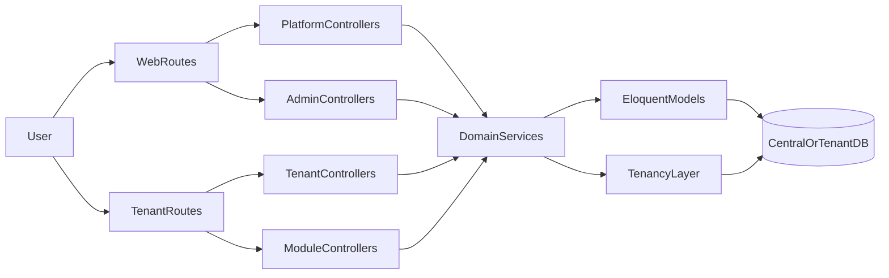

## YayasanEdu Backend Architecture

### Lapisan Utama

- **Platform (Central App)**: Manajemen yayasan, subscription, billing platform, marketplace & plugin. Controller berada di `app/Http/Controllers/Platform` dengan route prefix `/platform` di `routes/web.php`.
- **Tenant (School App)**: Fitur harian sekolah (siswa, guru, keuangan, akademik, PPDB, attendance). Route utama di `routes/tenant.php` dengan middleware tenancy `InitializeTenancyByDomain` & `PreventAccessFromCentralDomains`.
- **Admin**: Panel admin internal untuk mengelola yayasan & plan (`app/Http/Controllers/Admin`).
- **Yayasan (Enterprise)**: Fitur khusus yayasan/holding di area tenant dengan prefix `/yayasan` dalam `routes/tenant.php`.

### Pola Controller–Service–Model

- **Controller tipis**:
  - Validasi request (idealnya via Form Request).
  - Delegasi logika bisnis ke service (mis. `InvoiceService`, `PaymentService`, `AttendanceService`).
  - Mengembalikan response (view Blade untuk web, `ApiResponse` untuk JSON).
- **Service** (`app/Services/...` atau `app/Modules/*/Services/...`):
  - Menangani aturan bisnis lintas model.
  - Bertanggung jawab untuk transaksi kompleks, kalkulasi, dan koordinasi antar model.
  - Menyediakan API yang jelas untuk controller (mis. `generateMassInvoices`, `createPayment`, `clockIn`).
- **Model**:
  - Menyimpan relasi, scope query (`forSchool`, `unpaid`, dll.), dan helper sederhana seperti `generateInvoiceNumber()` atau `updatePaymentStatus()`.

Contoh yang sudah diadopsi di domain Finance (tenant):

- `Tenant\FinanceController` kini memanggil:
  - `App\Services\Finance\InvoiceService` untuk list, create, dan generate mass invoice.
  - `App\Services\Finance\PaymentService` untuk list & create payment, termasuk SPP payment multiple invoice.

### Multi-Tenancy

- **Paket**: `stancl/tenancy` dengan konfigurasi di `config/tenancy.php`.
- **Model tenant**: `App\Models\Tenant`.
- **Resolusi tenant**:
  - Tenant diinisialisasi oleh middleware `InitializeTenancyByDomain` & `PreventAccessFromCentralDomains` di `routes/tenant.php`.
  - Database tenant memakai koneksi `tenant` dengan nama DB berdasarkan `tenant_id` (prefix & suffix kosong).
- **Scope data sekolah**:
  - Banyak model tenant memakai field `school_unit_id` dan scope `forSchool($schoolId)`, misalnya:
    - `Finance\Invoice::forSchool($schoolId)`
    - `Finance\Payment::forSchool($schoolId)`
    - `Finance\Expense::forSchool($schoolId)`
    - `Finance\CashTransaction::forSchool($schoolId)`
  - Di controller tenant, selalu ambil `school_unit_id` dari `auth()->user()` dan gunakan scope tersebut.
- **Helper slug sekolah**:
  - `app/Core/Helpers/school_helper.php` menyediakan `getSchoolSlug()` untuk mengekstrak slug sekolah dari URL atau fallback ke `school_unit_id` user.

### Modul di `app/Modules`

- **Attendance**:
  - Modul lengkap dengan `Config`, `Http/Controllers` (Admin + Api), `Models`, `Services`, `Routes/web.php`, `Routes/api.php`, `DESIGN.md`.
  - Menjadi contoh modul bounded context penuh (attendance plugin).
- **CBT**:
  - Modul ujian berbasis komputer (`Config`, `Models`, `Services`, `Providers`).
- **Student, Finance, PPDB, User**:
  - Berisi `Routes` dan sebagian `Services/Models` yang melengkapi domain inti tenant.
  - Sebagian besar route masih dikomentari (rencana ekspansi modul di masa depan).

Konvensi modul:

- Struktur ideal:
  - `app/Modules/{Name}/Config`
  - `app/Modules/{Name}/Http/Controllers`
  - `app/Modules/{Name}/Services`
  - `app/Modules/{Name}/Models`
  - `app/Modules/{Name}/Routes`
  - `app/Modules/{Name}/Database`
  - `app/Modules/{Name}/Views` (jika perlu UI khusus).
- Route modul memakai prefix & name space jelas (mis. `attendance`, `ppdb`, `users`) dan di-load oleh service provider modul.

### Pola Response & Error Handling

- **Helper JSON standar**: `App\Http\Responses\ApiResponse`
  - `ApiResponse::success(data, message, status, meta)` menghasilkan:
    - `{ "success": true, "message": "...", "data": ..., "meta": ... }`
  - `ApiResponse::error(message, status, errors, meta)` menghasilkan:
    - `{ "success": false, "message": "...", "errors": ..., "meta": ... }`
- **Contoh penerapan**:
  - `App\Modules\Attendance\Http\Controllers\Api\AttendanceApiController` menggunakan `ApiResponse` untuk endpoint:
    - `/api/attendance/clock-in`
    - `/api/attendance/clock-out`
    - `/api/attendance/status`
    - `/api/attendance/history`
    - `/api/attendance/today`
    - dll.
- **Guideline**:
  - Web route (Blade) tetap menggunakan redirect + flash message.
  - API route baru sebaiknya selalu memakai `ApiResponse` agar konsisten.
  - Validasi request menggunakan Form Request jika logika validasi mulai kompleks.

### Testing

- Struktur testing:
  - `tests/Feature` untuk flow end-to-end (auth, profil, PPDB, dll.).
  - `tests/Unit` untuk unit logic kecil (helper, model method).
  - `tests/Feature/Tenant/...` untuk skenario tenant (sekolah) spesifik.
- Contoh test domain kritikal:
  - `tests/Feature/PPDBApplicantFilterTest.php` menguji filter applicant PPDB berdasarkan `payment_status`.
  - `tests/Feature/Tenant/Finance/InvoiceListingTest.php` (baru) menguji bahwa user tenant bisa melihat daftar invoice sekolah melalui route `tenant.school.finance.invoices.index`.
- Rekomendasi ke depan:
  - Tambah test untuk:
    - Proses pembayaran invoice & update status.
    - Flow PPDB: pendaftaran publik → verifikasi → pembayaran → approve.
    - Attendance API dasar (`clockIn`, `clockOut`).

### Rencana Refactor Bertahap

1. **Tahap 1 – Contoh pola baru**
   - Menjadikan `Tenant\FinanceController` dan modul Attendance (API) sebagai contoh referensi:
     - Controller tipis.
     - Service layer kuat.
     - Response JSON standar via `ApiResponse` untuk endpoint API.
2. **Tahap 2 – Ekstraksi service domain berisiko tinggi**
   - Domain Billing/Subscription:
     - Ekstraksi logika subscription & platform payment ke service serupa `Finance\InvoiceService`/`PaymentService`.
   - Domain PPDB:
     - Buat `PPDBRegistrationService` untuk pendaftaran, tracking status, dan verifikasi pembayaran.
3. **Tahap 3 – Konsolidasi modul**
   - Lengkapi modul `Finance`, `Student`, `PPDB`, dan `User` sehingga pola strukturnya mengikuti `Attendance`:
     - Pisahkan controller, service, routes modul dari core tenant controller jika diperlukan.
4. **Tahap 4 – Perluasan testing**
   - Tambah Feature test untuk flow kritikal:
     - Pembayaran invoice & cicilan.
     - Proses PPDB end-to-end.
     - Attendance API dasar.

