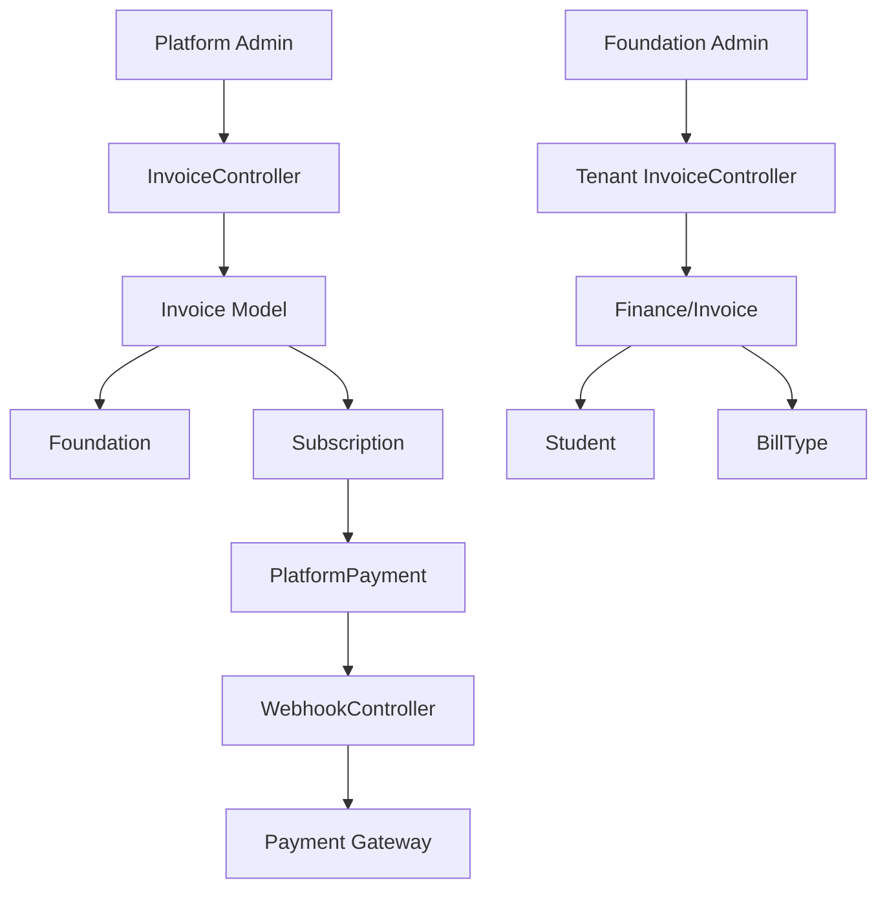
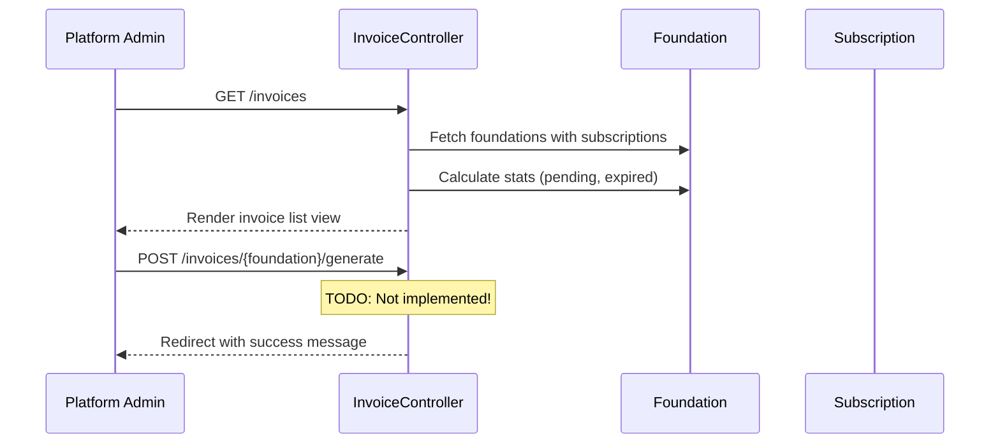
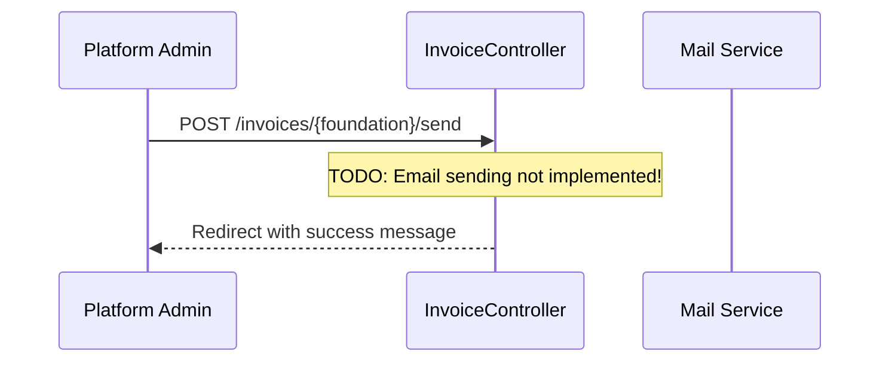
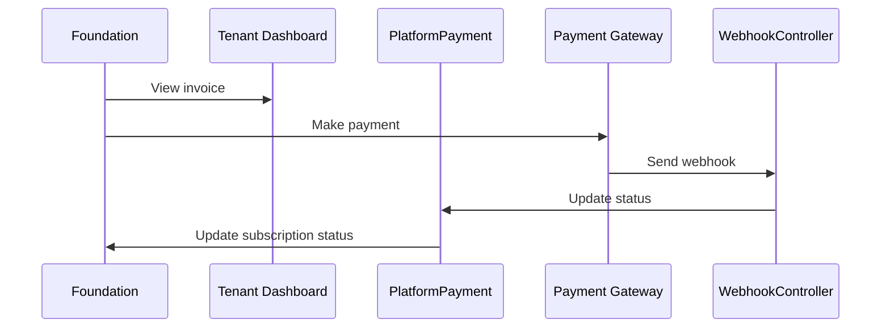
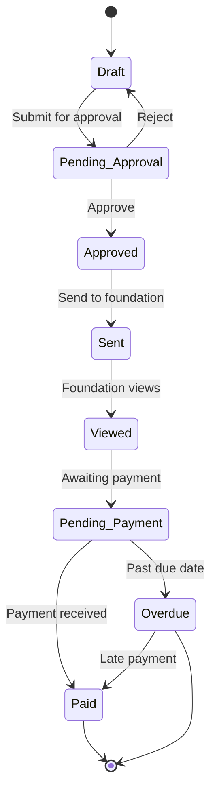

# Invoice System Analysis - YayasanEdu-App

**Analysis Date:** March 15, 2026  
**System URL:** http://localhost:8000/platform/invoices  
**Mode:** Architect - Comprehensive Process Analysis

---

## Executive Summary

This report analyzes the end-to-end invoice workflow for the YayasanEdu-App multi-tenant school management platform. The analysis covers invoice creation, verification, approval, delivery, and payment confirmation processes. Multiple critical bottlenecks and inefficiencies were identified that require immediate attention to optimize the revenue collection cycle.

---

## 1. Current System Architecture

### 1.1 Invoice Data Models

The system implements **two parallel invoice systems**:

| Model | Purpose | Location |
|-------|---------|----------|
| [`App\Models\Invoice`](app/Models/Invoice.php) | Platform-level subscription invoices | Central database |
| [`App\Models\Finance\Invoice`](app/Models/Finance/Invoice.php) | Tenant-level student billing | Per-tenant database |

### 1.2 Key Components



---

## 2. Current Workflow Analysis

### 2.1 Invoice Creation Flow

**Route:** [`/platform/invoices`](routes/web.php:146)



**Current Status:** 
- [`generate()`](app/Http/Controllers/Platform/InvoiceController.php:74) method contains only TODO comment
- No actual invoice generation logic exists

### 2.2 Invoice Delivery Flow

**Route:** [`/platform/invoices/{foundation}/send`](routes/web.php:149)



**Current Status:**
- [`send()`](app/Http/Controllers/Platform/InvoiceController.php:83) method contains only TODO comment
- No actual email sending logic exists

### 2.3 Payment Flow

**Routes:**
- [`/platform/payments`](routes/web.php:247) - Payment list
- [`/platform/payments/{payment}/confirm`](routes/web.php:251) - Manual confirmation
- [`/webhook/{gateway}`](routes/web.php:270) - Automated webhook



**Current Status:**
- Webhook handling exists in [`WebhookController`](app/Http/Controllers/Platform/WebhookController.php:20)
- Manual payment confirmation in [`PaymentController`](app/Http/Controllers/Platform/PaymentController.php:166)
- Missing: Payment link generation for foundations

---

## 3. Identified Bottlenecks & Inefficiencies

### 3.1 Critical Issues (High Impact)

| # | Issue | Location | Impact |
|---|-------|----------|--------|
| B1 | **Invoice generation not implemented** | [`InvoiceController:74-81`](app/Http/Controllers/Platform/InvoiceController.php:74) | Cannot create new invoices |
| B2 | **Invoice sending not implemented** | [`InvoiceController:83-90`](app/Http/Controllers/Platform/InvoiceController.php:83) | Cannot notify foundations |
| B3 | **No automated invoice generation** | Subscription system | Manual process for each invoice |
| B4 | **No payment link generation** | Tenant view | Foundations cannot pay online |
| B5 | **Missing invoice-connection** | [`Invoice`](app/Models/Invoice.php) ↔ [`PlatformPayment`](app/Models/PlatformPayment.php) | No link between invoice and payment |

### 3.2 Medium Issues

| # | Issue | Location | Impact |
|---|-------|----------|--------|
| M1 | **No approval workflow** | Invoice controller | No multi-level approval |
| M2 | **No automatic reminders** | System | Manual follow-up required |
| M3 | **No overdue invoice handling** | [`InvoiceController:index()`](app/Http/Controllers/Platform/InvoiceController.php:13) | Stats show pending but no action |
| M4 | **Duplicate status tracking** | Foundation has `subscription_ends_at` but invoice has separate `due_date` | Data inconsistency |
| M5 | **No PDF generation** | Invoice view shows "Download PDF" button but no backend | Cannot download invoice |

### 3.3 Minor Issues

| # | Issue | Impact |
|---|-------|--------|
| N1 | No invoice search/filter by date range | Hard to find specific invoices |
| N2 | No bulk invoice generation | Manual for multiple foundations |
| N3 | No payment receipt generation | Limited documentation |
| N4 | No invoice numbering customization | Limited flexibility |

---

## 4. Detailed Process Analysis by Stage

### 4.1 Stage 1: Invoice Creation

**Expected Flow:**
1. Platform admin selects foundation
2. System pulls subscription plan and pricing
3. Invoice number auto-generated
4. Due date calculated
5. Invoice created in database

**Current Implementation:**
```php
// app/Http/Controllers/Platform/InvoiceController.php:74-81
public function generate(Foundation $foundation, Request $request)
{
    // Generate new invoice logic
    // TODO: Implement invoice generation logic
    
    return redirect()->route('platform.invoices.show', $foundation)
        ->with('success', 'Invoice berhasil dibuat.');
}
```

**Gap:** No logic to retrieve plan price, calculate due date, or create invoice record.

### 4.2 Stage 2: Verification

**Expected Flow:**
1. Invoice data validated
2. Amount verified against plan price
3. Foundation details confirmed
4. Invoice marked as "verified"

**Current Implementation:** No verification step exists.

**Gap:** Invoices go directly from creation to pending without verification.

### 4.3 Stage 3: Approval

**Expected Flow:**
1. Supervisor reviews invoice
2. Approves or rejects
3. Status updated

**Current Implementation:** No approval workflow exists.

**Gap:** Any admin can generate and send invoices without approval.

### 4.4 Stage 4: Delivery/Sending

**Expected Flow:**
1. Invoice sent via email
2. Copy stored in system
3. Delivery status tracked

**Current Implementation:**
```php
// app/Http/Controllers/Platform/InvoiceController.php:83-90
public function send(Foundation $foundation, Request $request)
{
    // Send invoice email logic
    // TODO: Implement email sending logic
    
    return redirect()->route('platform.invoices.show', $foundation)
        ->with('success', 'Invoice berhasil dikirim.');
}
```

**Gap:** No email template, no sending logic, no tracking.

### 4.5 Stage 5: Payment

**Expected Flow:**
1. Foundation receives invoice
2. Foundation clicks payment link
3. Makes payment via gateway
4. System receives webhook confirmation
5. Invoice marked as paid

**Current Implementation:**
- Foundation can view invoice at [`/tenant/invoices`](resources/views/tenant/invoices/index.blade.php)
- No "Pay" functionality - button shows but doesn't work

**Gap:** 
- [`Tenant InvoiceController`](app/Http/Controllers/Tenant/InvoiceController.php:23) has `download()` method but no payment method
- No payment gateway integration for foundations

### 4.6 Stage 6: Confirmation

**Expected Flow:**
1. Payment confirmed via webhook
2. Subscription extended
3. Receipt generated
4. Notification sent

**Current Implementation:** Partial - webhook updates payment status but doesn't extend subscription.

**Gap:** No connection between [`PlatformPayment`](app/Models/PlatformPayment.php) and subscription extension.

---

## 5. Actionable Improvement Recommendations

### 5.1 Immediate Actions (Week 1-2)

#### R1: Implement Invoice Generation Logic
```php
// In InvoiceController::generate()
public function generate(Foundation $foundation, Request $request)
{
    $validated = $request->validate([
        'billing_cycle' => 'required|in:monthly,yearly',
        'due_days' => 'required|integer|min:1|max:60',
    ]);
    
    $plan = $foundation->plan;
    $amount = $validated['billing_cycle'] === 'yearly' 
        ? $plan->price_per_year 
        : $plan->price_per_month;
    
    $invoice = Invoice::create([
        'foundation_id' => $foundation->id,
        'subscription_id' => $foundation->subscriptions()->latest()->first()?->id,
        'invoice_number' => Invoice::generateInvoiceNumber(),
        'amount' => $amount,
        'status' => 'pending',
        'due_date' => now()->addDays($validated['due_days']),
        'items' => json_encode([
            'plan' => $plan->name,
            'billing_cycle' => $validated['billing_cycle'],
            'period' => now()->format('F Y'),
        ]),
    ]);
    
    return redirect()->route('platform.invoices.show', $foundation)
        ->with('success', 'Invoice #' . $invoice->invoice_number . ' berhasil dibuat.');
}
```

#### R2: Implement Invoice Sending with Email
```php
// In InvoiceController::send()
public function send(Foundation $foundation, Request $request)
{
    $invoice = $foundation->invoices()->latest()->first();
    
    if (!$invoice) {
        return redirect()->back()->with('error', 'Tidak ada invoice untuk yayasan ini.');
    }
    
    // Send email notification
    Mail::to($foundation->email)->send(new InvoiceCreated($invoice));
    
    // Log sending
    activity()->on($invoice)->log('invoice_sent');
    
    return redirect()->route('platform.invoices.show', $foundation)
        ->with('success', 'Invoice berhasil dikirim ke ' . $foundation->email);
}
```

### 5.2 Short-term Actions (Week 3-4)

#### R3: Add Payment Link Generation
Create a payment endpoint that generates unique payment URLs for foundations:

```php
// routes/web.php addition
Route::post('/invoices/{invoice}/payment-link', [InvoiceController::class, 'generatePaymentLink'])
    ->name('invoices.payment-link');
```

#### R4: Implement Automated Reminders
Create a scheduled command to send payment reminders:

```php
// app/Console/Commands/SendInvoiceReminders.php
$overdueInvoices = Invoice::where('due_date', '<', now())
    ->where('status', 'pending')
    ->get();

foreach ($overdueInvoices as $invoice) {
    Mail::to($invoice->foundation->email)->send(new PaymentReminder($invoice));
}
```

#### R5: Connect Payment to Subscription Extension
Update [`WebhookController`](app/Http/Controllers/Platform/WebhookController.php:252) to extend subscription:

```php
protected function handlePaymentSuccess(array $payload): bool
{
    // Existing payment update logic...
    
    // Add subscription extension
    $subscription = $invoice->subscription;
    if ($subscription) {
        $subscription->extend(
            $invoice->billing_cycle === 'yearly' ? '1 year' : '1 month'
        );
    }
    
    return true;
}
```

### 5.3 Medium-term Actions (Month 2-3)

#### R6: Implement Approval Workflow
Add status field and approval steps:

```php
// Add to invoices table migration
$table->enum('approval_status', ['draft', 'pending_approval', 'approved', 'rejected'])->default('draft');
$table->foreignId('approved_by')->nullable();
$table->timestamp('approved_at')->nullable();
```

#### R7: Add Bulk Invoice Generation
Allow batch invoice creation for all active foundations:

```php
public function bulkGenerate(Request $request)
{
    $foundations = Foundation::where('status', 'active')
        ->whereNull('pending_invoice')
        ->get();
    
    foreach ($foundations as $foundation) {
        // Generate invoice for each
    }
    
    return redirect()->route('platform.invoices.index')
        ->with('success', "Generated {$foundations->count()} invoices.");
}
```

#### R8: Implement PDF Generation
Use DomPDF or similar library to generate invoice PDFs.

### 5.4 Long-term Actions (Month 4+)

#### R9: Multi-currency Support
Add currency field to support international foundations.

#### R10: Recurring Auto-billing
Implement automatic invoice generation for subscription renewals.

---

## 6. Implementation Priority Matrix

| Priority | Recommendation | Effort | Impact | Deadline |
|----------|----------------|--------|--------|----------|
| P0 | R1: Invoice Generation | Medium | Critical | Week 1 |
| P0 | R2: Invoice Sending | Medium | Critical | Week 2 |
| P1 | R3: Payment Links | High | High | Week 3 |
| P1 | R4: Auto Reminders | Low | Medium | Week 4 |
| P2 | R5: Payment→Subscription | Medium | High | Week 5 |
| P2 | R6: Approval Workflow | High | Medium | Week 6 |
| P3 | R7: Bulk Generation | Medium | Medium | Week 8 |
| P3 | R8: PDF Generation | Medium | Medium | Week 10 |

---

## 7. Data Flow Improvements

### 7.1 Recommended Invoice Lifecycle



### 7.2 Database Schema Improvements

Add foreign key relationship between Invoice and PlatformPayment:

```php
// In PlatformPayment migration
$table->foreignId('invoice_id')->nullable()->constrained('invoices')->onDelete('set null');
```

---

## 8. Monitoring & Analytics

### 8.1 Key Metrics to Track

| Metric | Current | Target |
|--------|---------|--------|
| Invoice generation time | Manual | < 5 minutes |
| Invoice delivery rate | 0% | 100% |
| Payment success rate | Unknown | > 90% |
| Average payment time | Unknown | < 7 days |
| Overdue rate | Unknown | < 10% |

### 8.2 Dashboard Additions

Add to [`platform/invoices/index.blade.php`](resources/views/platform/invoices/index.blade.php):
- Days since last invoice per foundation
- Average payment time trend
- Invoice aging report
- Revenue forecasting

---

## 9. Risk Assessment

| Risk | Probability | Impact | Mitigation |
|------|-------------|--------|------------|
| Invoice generation breaks existing subscriptions | Low | High | Add validation and testing |
| Email delivery failures | Medium | Medium | Implement email queue and retry |
| Payment gateway downtime | Medium | High | Multi-gateway support |
| Data inconsistency between invoice and subscription | Medium | High | Implement transactional consistency |

---

## 10. Conclusion

The current invoice system has significant gaps that prevent effective revenue collection. The most critical issues are:

1. **Invoice generation is not functional** - Cannot create new invoices
2. **Invoice delivery is not implemented** - Cannot send invoices to foundations  
3. **Payment integration is incomplete** - No payment links for foundations
4. **Missing approval workflow** - No control over invoice creation

### Immediate Next Steps

1. **This Week:** Implement R1 (Invoice Generation) and R2 (Invoice Sending)
2. **Next Week:** Add payment link generation (R3)
3. **Week 3-4:** Implement automated reminders (R4) and payment-to-subscription connection (R5)

The system architecture is sound - the issue is primarily incomplete implementation of core features. Following the recommendations above will establish a complete, automated invoice-to-payment workflow.

---

**Report Prepared By:** Architect Mode Analysis  
**Next Review:** After implementation of P0 recommendations
