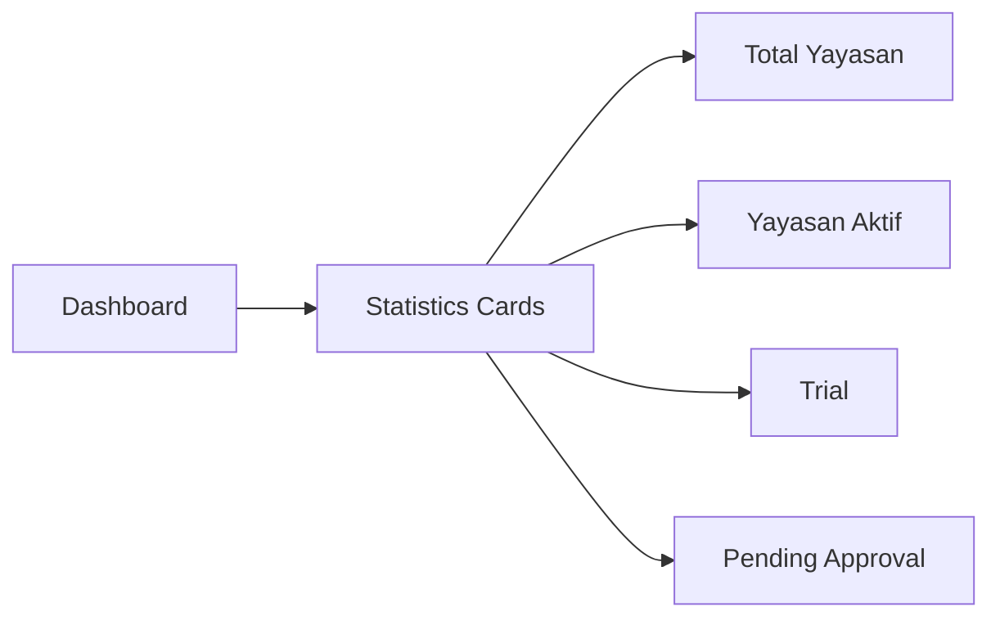

# Platform Dashboard Improvement Plan

## Executive Summary

The existing platform dashboard has a solid foundation but needs enhancements to match professional SaaS standards. Based on the requirements, the dashboard should focus on **monitoring and analytics** rather than school activities.

---

## Current State Analysis

### Already Implemented ✅
1. **Statistics Cards**: Total Yayasan, Total Sekolah, Total Siswa, Yayasan Aktif
2. **Subscription Statistics**: Active subscriptions, Trial, Expired plans
3. **User Statistics**: Total users, Verified, Unverified, Active in 7 days
4. **Recent Activity**: Foundation registration activity
5. **System Health**: Database, Storage, Memory status with progress bars
6. **Quick Actions**: Navigation links to admin pages

### Missing Components ❌
1. **Growth Chart** - Monthly foundation registration visualization
2. **Pending Approval Widget** - With Approve/Reject action buttons
3. **Enhanced Quick Actions** - SaaS-style: Approve yayasan, Buat paket, Kirim pengumuman
4. **Login Activity Log** - Recent login tracking
5. **Real Server Monitoring** - CPU, RAM, actual server metrics
6. **Error Log Widget** - System error tracking

---

## Detailed Implementation Plan

### Phase 1: Statistics Cards Restructuring

**Current Cards:**
- Total Yayasan: 320
- Total Sekolah: 280
- Total Siswa: 15,432
- Yayasan Aktif: 280

**Required Cards (per SaaS standard):**
- Total Yayasan: 320
- Yayasan Aktif: 280
- Trial: 25
- Pending Approval: 15



### Phase 2: Growth Chart Implementation

**Requirements:**
- Monthly foundation registration chart
- Library: Chart.js or ApexCharts
- 12-month rolling view

**Data Points:**
- Jan: 12 yayasan
- Feb: 18 yayasan
- Mar: 25 yayasan
- Apr: 30 yayasan
- ...etc

### Phase 3: Activity & Monitoring Widgets

**Widget Structure:**
```
┌─────────────────────────────────────┐
│ Aktivitas Sistem                    │
├─────────────────────────────────────┤
│ • Login terbaru                     │
│ • Yayasan baru                       │
│ • Aktivitas admin                   │
└─────────────────────────────────────┘

┌─────────────────────────────────────┐
│ Yayasan Pending Approval            │
├─────────────────────────────────────┤
│ • Yayasan Cendekia    [Approve][X]  │
│ • Yayasan Bangsa      [Approve][X]  │
│ • Yayasan Al Falah    [Approve][X]  │
└─────────────────────────────────────┘
```

### Phase 4: System Monitoring Enhancement

**Server Metrics:**
- CPU Usage: Real percentage
- RAM Usage: GB / Total GB
- Database Size: MB/GB
- Storage Usage: Percentage

### Phase 5: Quick Actions (SaaS Style)

**Actions:**
1. Approve yayasan (pending count badge)
2. Buat paket (link to plan creation)
3. Kirim pengumuman (notification broadcast)

### Phase 6: Sidebar Navigation Update

**New Platform Menu Structure:**
```
Dashboard

Yayasan
- Semua Yayasan
- Pending
- Trial
- Aktif
- Suspend

Paket & Subscription
- Paket
- Billing
- Pembayaran

Monitoring
- Aktivitas Sistem
- Login Log
- Error Log

Manajemen Sistem
- User Platform
- Role Permission
- Pengaturan Platform

Konten
- Pengumuman
- Notifikasi

Developer
- API
- Webhook
```

---

## File Changes Required

| File | Action | Description |
|------|--------|-------------|
| `resources/views/dashboard.blade.php` | Modify | Complete redesign with all new widgets |
| `app/Services/Monitoring/SystemMonitor.php` | Enhance | Add server CPU/RAM monitoring |
| `resources/views/layouts/platform.blade.php` | Modify | Update sidebar navigation |
| `resources/views/components/sidebar.blade.php` | Create/Modify | Platform sidebar component |
| `resources/js/chart-config.js` | Create | Chart.js configuration |

---

## Implementation Priority

1. **High Priority** (Must have)
   - Restructure Statistics Cards
   - Add Growth Chart
   - Pending Approval Widget with actions
   - Enhanced System Monitoring

2. **Medium Priority** (Should have)
   - Recent Login Activity Widget
   - Enhanced Quick Actions
   - Updated Sidebar Navigation

3. **Low Priority** (Nice to have)
   - Error Log Widget
   - API/Webhook menu items

---

## Design Principles

1. **Clean & Simple** - Minimalist SaaS aesthetic
2. **Data Driven** - Focus on metrics and analytics
3. **Monitoring Oriented** - Real-time system health
4. **Actionable** - Quick action buttons for common tasks

---

## Technology Stack

- **Charts**: Chart.js (already available via npm)
- **Icons**: Heroicons / SVG
- **Styling**: Tailwind CSS (already in use)
- **Real-time**: Livewire or simple JS polling for server metrics
